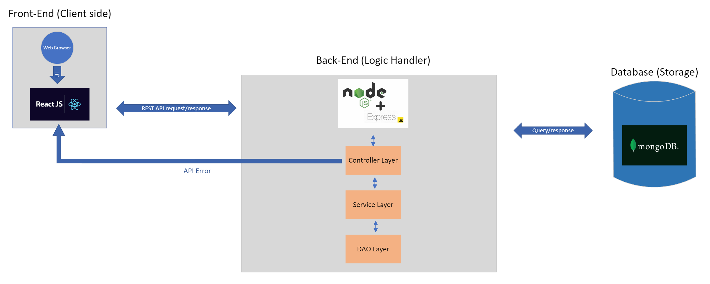

# FamilyHub
--------------

## Team Members
| Member             | GitHub ID          | Email                   |
|--------------------|--------------------|-------------------------|
| Freyja Kristjanson | @FreyjaKristjanson | kristjaf@myumanitoba.ca |
| Jasmine Tabuzo     | @jasmine-tabuzo    | tabuzoj@myumanitoba.ca  |
| Juan Armijos       | @armijosj          | armijosj@myumanitoba.ca |
| Tanisha Turner     | @TTanisha          | turnert1@myumanitoba.ca |

---

## How to run it:

### Front End AND Back End using Docker

In the repository directory type:

- For building images, creating containers and running them:

    ```
    docker-compose up --build
     ```

- For building images, creating containers but not running them:

    ```
    docker-compose up --build --no-start
    ```


### Only Front End

Inside **./front_end/** directory, type:

- Using docker:
    - Create the image:

        ```
        docker build ./ -t armijosj/familyhub:client
        ```

    - Run the image

        ```
        docker run -p 5173:5173 armijosj/familyhub:client
        ```

- Using npm:

    ``` 
    npm install
    npm run dev
    ```

- Using pnpm:

   ```
    pnpm install
    pnpm run dev
   ```

### Only Back End

Inside **./back_end/** directory, type:

- Using docker:

    - Create the image:

        ```
        docker build ./ -t armijosj/familyhub:server
        ```

    - Run the image

        ```
        docker run -p 5000:5000 armijosj/familyhub:server
        ```

- Using npm:

    ``` 
    npm install
    npm run dev
    ```

---

## Vision

FamilyHub is a web-based application designed to help families stay on top of important events with their loved ones through the use of a shared calendar. This application aims to reduce friction and conflict within families by enabling them to improve their organization and communication of events. Thus, FamilyHub will help bring families closer together by giving them an avenue to stay connected, share memories, plan events, and build stronger bonds. 

---

## Summary

FamilyHub is designed primarily for the use of families who are wanting to organize and keep track of their shared events, such as birthdays, anniversaries, movie nights, etc. It allows family members to gain access to a privately shared calendar where they can add, edit, and remove one-time or recurring events. This shared calendar can only be viewed by members of that family group.  

This application is valuable because it can help reduce the stress of planning and remembering family events. Being able to view all family events on one calendar helps to avoid scheduling conflicts when planning new events. Additionally, as the events are shared with everyone in the family group, the issue of having to invite each family member every time is avoided. Thus, family members can have confidence in knowing that no one is accidentally left out. Overall, the goal of FamilyHub is to bring families closer together and to create a positive impact on the relationships and connections among family members. 

After some use, users of the application will be asked to complete a survey that compares the FamilyHub application to traditional wall calendars. The success of this application will be determined by the following criteria. First, a majority of users should prefer to use this application over traditional wall calendars. Second, the average frequency of application usage should be at least twice a week. 

---

## Core Features ## 

* Shared Calendar 
    * Users of the same family group will be able to view a shared calendar.
    * The calendar can be seen in a monthly or daily view. 
    * Users can add recurring or one-time events to the calendar. 

* Family Member Profiles
    * Users can add personal information to their profile (name, pronouns, birthday, email, cell and home numbers, and address). 
    * Users can view and edit their own profile.
    * Users can view the profile of other family members. 

* Family Groups
    * Users can create family groups.
    * Users that belong to a family group can see events on their calendars.
    * Users can invite other family members to the group.
    * Users can leave the family group.

* Able to respond to 100 users with 1000 requests per minute concurrently. ( for example: 100 users would add 10 events to the calendar.

---

## Technologies ##

* Front-end: ReactJS
* Back-end: Node.js Express.js
* Storage: MongoDB

---

## Architecture Diagram



---

## User Stories

### Shared Calendar
* As a family member, I want to be able to view the shared calendar. 
    * As a family member I would like to be able to see a monthly view of the family calendars I am a part of
    * As a family member I would like to be able to see a view of all family events for a specific day.
    * As a family member, I want to be able to view the details of a single event in the calendar. 
* As a family member, I want to be able to add an event to a family calendar. 
    * As a family member, I want to be able to add a recurring event to the calendar. 
    * As a family member, I want to be able to add a single event to the calendar. 
* As a family member, I want to be able to remove an event from a family calendar.
    * As a family member, I want to be able to remove a recurring event in the calendar. 
    * As a family member, I want to be able to remove a single (cancelled)  event to the calendar. 
* As a family member, I want to be able to edit an event on a family calendar.
    * As a family member, I want to be able to edit a recurring event in the calendar. 
    * As a family member, I want to be able to edit a single event in the calendar. 

### Family Member Profiles
* As a signed-in user, I want to be able to add/edit my personal information.   
   * As a signed-in user, I want to be able to include my name in my profile. 
   * As a signed-in user, I want to be able to include my pronouns in my profile. 
   * As a signed-in user, I want to be able to include my birthday in my profile. 
   * As a signed-in user, I want to be able to include my cell number in my profile. 
   * As a signed-in user, I want to be able to include my home phone number in my profile.
   * As a signed-in user, I want to be able to include my address in my profile. 
* As a signed-in user, I want to be able to view my own profile. 
* As a signed-in user in a family group, I want to be able to view other family members' profiles. 

### Family Groups
* As a family member, I want to be able to invite my family members to the family group.
* As a family member, I would like to be able to create a family group 
* As a user, I want to be able to leave a family group.
