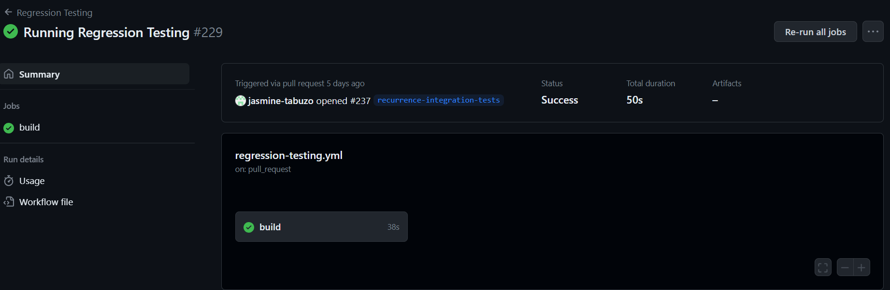
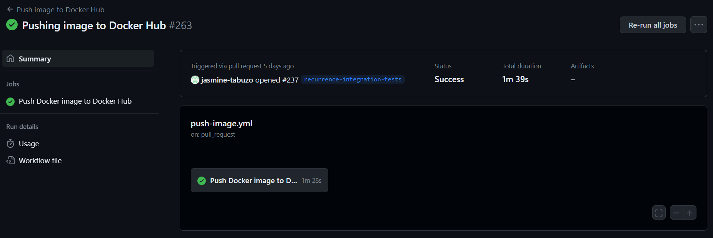
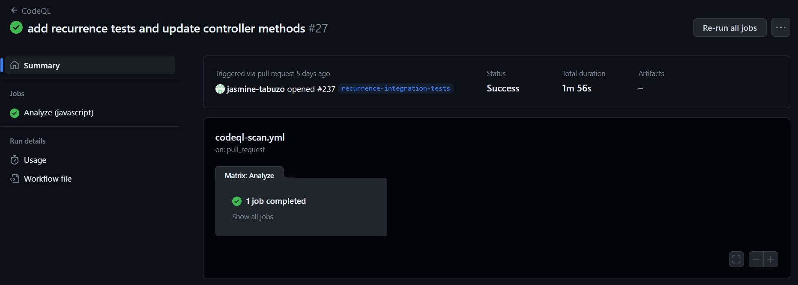

# FamilyHub Release Summary

## Team members 

| Member             | GitHub ID          | Email                   | Role | 
|--------------------|--------------------|-------------------------|---|
| Freyja Kristjanson | @FreyjaKristjanson | kristjaf@myumanitoba.ca |Backend Developer, DB Manager|
| Jasmine Tabuzo     | @jasmine-tabuzo    | tabuzoj@myumanitoba.ca  |Full-stack developer|
| Juan Armijos       | @armijosj          | armijosj@myumanitoba.ca |Configuration Manager, Installation Team|
| Tanisha Turner     | @TTanisha          | turnert1@myumanitoba.ca |Frontend Developer|


## Project summary

1. Elevator pitch description at a high-level. 
2. Highlight the differences between the final version and proposal if applicable

## GitHub repository Link

https://github.com/TTanisha/FamilyHub

## DockerHub repository link 

1. **DockerHub link:** [Docker - FamilyHub](https://hub.docker.com/repository/docker/armijosj/familyhub/general)

2. **Instructions:**

    In a terminal run the following commands:
    ```
    docker pull armijosj/familyhub:server
    docker run -p 8080:8080 armijosj/familyhub:server
    ```

    In a different terminal:
    ```
    docker pull armijosj/familyhub:client
    docker run -p 5173:5173 armijosj/familyhub:client
    ```

    You can now access FamilyHub at ```http://localhost:5173/```

    *NOTE:* Run server before running client. 


## List of user stories for each sprint

Example: US #1: US name [Status: Done, Removed, Pushed]

### Sprint 1

- Sprint 1 was used for planning.

### Sprint 2 

- US [#53](https://github.com/TTanisha/FamilyHub/issues/53): Sign Into Account [Status: Done]

- US [#51](https://github.com/TTanisha/FamilyHub/issues/51): Create an Account [Status: Done]

- US [#20](https://github.com/TTanisha/FamilyHub/issues/20): Delete Individual Profile [Status: Pushed]

- US [#52](https://github.com/TTanisha/FamilyHub/issues/52): Delete an Account [Status: Pushed]

- US [#54](https://github.com/TTanisha/FamilyHub/issues/54): Sign Out of Account [Status: Pushed]

- US [#56](https://github.com/TTanisha/FamilyHub/issues/56): Edit Personal Information [Status: Pushed]

- US [#55](https://github.com/TTanisha/FamilyHub/issues/55): Add Personal Information [Status: Pushed]

- US [#63](https://github.com/TTanisha/FamilyHub/issues/63): Edit Personal Information [Status: Pushed]


### Sprint 3 

- US [#20](https://github.com/TTanisha/FamilyHub/issues/20): Delete Individual Profile [Status: Done]

- US [#21](https://github.com/TTanisha/FamilyHub/issues/21):Invite Family Members to group [Status: Done]

- US [#22](https://github.com/TTanisha/FamilyHub/issues/22):Create Family Group [Status: Done]

- US [#23](https://github.com/TTanisha/FamilyHub/issues/23):Leave Family Group [Status: Done]

- US [#52](https://github.com/TTanisha/FamilyHub/issues/51): Delete an Account [Status: Done]

- US [#54](https://github.com/TTanisha/FamilyHub/issues/54): Sign Out of Account [Status: Done]

- US [#55](https://github.com/TTanisha/FamilyHub/issues/55): Add Personal Information [Status: Done]

- US [#56](https://github.com/TTanisha/FamilyHub/issues/56): Edit Personal Information [Status: Done]

- US [#63](https://github.com/TTanisha/FamilyHub/issues/63): Edit Personal Information [Status: Done]

### Sprint 4 

- All User stories were completed in Sprint 3.

### Release

- All User stories were completed in Sprint 3.


## User manual

Provide instructions on how to run the application for each core feature. 

## Overall Architecture and Design

- [Architecture Diagram](docs/sprint-1/architecture-diagram.png)
- [Sequence Diagrams](docs/sprint-2/Sequence%20Diagrams/)
  - [User Profile](./docs/sprint-2/Sequence%20Diagrams/profile-page-sequence-diagram.png)
  - [Family Group](./docs/sprint-2/Sequence%20Diagrams/family-group-sequence-diagram.png)
  - [Shared Calendar](./docs/sprint-3/sequence-diagram-shared-calendar-v2.png)  

## Infrastructure

For each library, framework, database, tool, etc

- **JavaScript** [link]( https://developer.mozilla.org/en-US/docs/Web/JavaScript)

    We chose it because it is the most popular scripting language and is widely supported by web browsers, making it an excellent choice for client-side web development.

- **Axios** [link](https://axios-http.com/docs/intro)

    It's a lightweight and easy-to-use library for making HTTP requests in JavaScript applications. It has better error handling and supports automatic serialization of request and response data.

- **Docker** [link](https://docs.docker.com/)

    It provides a consistent and reproducible environment for developing and deploying applications, making it easier to manage dependencies and ensure consistency across different environments.

- **GitHub Actions** [link](https://docs.github.com/en/actions)

    It provides an easy-to-use and powerful platform for automating the software development process, just like Jenkins. The difference is that it is integrated with Github repos; therefore, it will be easier for us to create, manage and run workflows for building, testing and deploying software. Having things in one place will allow us to be more efficient.

- **Prettier** [link](https://reactjs.org/docs/getting-started.html)

    It's a code formatter that helps maintain consistent code style across the entire codebase, making it easier to read and understand code. It is a simple VS Code plug-in.

#### **Front End**

- **React** [link](https://reactjs.org/docs/getting-started.html)

    It's a popular JavaScript library for building user interfaces that allows for easy component-based development, efficient rendering, and easy integration with other libraries and frameworks. We choose it over Angular or Vue because of it relatively low learning curve.

- **Vite** [link](https://vitejs.dev/guide/)

    It's a fast build tool that helps reduce development time by improving the build and reload speed of modern web applications.

- **ToastUI** [link](https://ui.toast.com/)

    It's a collection of customizable UI components for building modern web applications with ease and provides a rich set of features and flexibility. We choose it because it has calendar component. Additionally, it was a TA recommendation.

- **NextUI**  [link](https://nextjs.org/docs/getting-started)

    It's a React-based UI framework that provides pre-built UI components and an easy-to-use API to help build modern web applications. We choose it because it has straighforward documentation.

#### **Back End**

- **Node.js** [link](https://nodejs.org/en/docs/)

    It's a JavaScript runtime that allows developers to build fast and scalable applications on the server-side using JavaScript. We use it because is the most common among web applications.


- **Express.js** [link](https://expressjs.com/)

    It's a fast and minimal web framework for Node.js that makes it easy to build web applications and APIs. It made the routing fast and easy.


- **MongoDB** [link](https://docs.mongodb.com/)

    It's a popular NoSQL database that provides high scalability, flexibility, and document-based data storage for modern web applications. It is also a popular choice for modern web applications because it allows for storing semi-structured data, making it a good fit for applications with dynamic data models.

- **mongoose** [link](https://mongoosejs.com/docs/)

    It's a MongoDB object modeling tool that provides a schema-based solution to model and interact with MongoDB data. This library made our database connection really simple.

#### **Testing**

- **Jest** [link](https://jestjs.io/docs/getting-started)

    It's preferred over other JavaScript testing frameworks because it has an easy-to-use API, a rich set of features, and good integration with other tools and frameworks. Plus we liked the code coverage feature.


- **Artillery** [link](https://artillery.io/docs/)

    It's a load testing tool that helps developers simulate and measure the performance of their applications under load and provides an easy-to-use API for creating complex test scenarios. We liked it because of the HTML generated report after the test.


- **CodeQL** [link](https://codeql.github.com/docs/)

    It's a static analysis tool that helps developers identify security vulnerabilities and other bugs in their codebase, with easy to set up instructions and lots of community support.


### Name and link
1 paragraph description of why you are using this framework, not other alternatives and why you didn’t choose them.

### Name Conventions
List your naming conventions or just provide a link to the standard ones used online.

For example: Java naming conventions


### Code
Key files: top 5 most important files (full path). We will also be randomly checking the code quality of files. Please let us know if there are parts of the system that are stubs or are a prototype so we grade these accordingly.
File path with a clickable GitHub link	Purpose (1 line description)

| File Path | Purpose | 
| --------- | ------- |
|           |         |
|           |         |
|           |         |
|           |         |
|           |         |

## Continuous Integration and deployment (CI/CD)
1. Describe your CI/CD environment and the clickable link to your CI/CD pipeline. For instance, if you use GitHub Action, provide the link to the workflow; if you use Jenkins, provide the link to the pipeline file. 
2. Snapshots of the CI/CD execution. Provide one for CI and one for CD to demo your have successfully set up the environment. 

We are using Github Action for our CI/CD pipeline. We separated the pipeline into three different workflows that run when there is an update to the main branch.

- [Regression Testing](https://github.com/TTanisha/FamilyHub/blob/main/.github/workflows/regression-testing.yml). 

    This is the first workflow that runs in our pipeline. If it fails then the image does not get pushed to DockerHub.

    

- [Push Image](https://github.com/TTanisha/FamilyHub/blob/main/.github/workflows/push-image.yml)

    This workflow pushes the image to DockerHub with the updated version of main branch.

    

- [CodeQL Scan](https://github.com/TTanisha/FamilyHub/blob/main/.github/workflows/codeql-scan.yml)

    This workflow performs a static analysis using CodeQL and notifies if there are any potential security breaches.

    


## Testing

### Link to Testing Plan


### Unit / Integration / Acceptance Tests

Each story needs a test before it is complete. In other word, the code coverage (in terms of statements) should be 100%. If some class/methods are missing unit tests, please describe why and how you are checking their quality. Please describe any unusual/unique aspects of your testing approach.

#### 10 Most Important Unit Tests 

(if there are more than one unit tests in one test file, indicate clearly).

| Test File Path | What it is Testing | 
| -------------- | ------------------ |
|                |                    |
|                |                    |
|                |                    |
|                |                    |
|                |                    |
|                |                    |
|                |                    |
|                |                    |
|                |                    |
|                |                    |


#### 5 Most Important Integration Tests  

| Test File Path | What it is Testing | 
| -------------- | ------------------ |
|                |                    |
|                |                    |
|                |                    |
|                |                    |
|                |                    |


#### 5 Most Important Acceptance Tests 

| Test File Path | What it is Testing | 
| -------------- | ------------------ |
|                |                    |
|                |                    |
|                |                    |
|                |                    |
|                |                    |


### Regression testing

1. Describe how you run the regression testing (e.g., which tests are executed for regression testing and which tool is used?). 
2. Provide the link to regression testing script and provide last snapshot of the execution and results of regression testing. 


### Load testing

1. Describe the environment for load testing, such as tool, load test cases.  
2. Provide the test report for load testing. 
3. Discuss one bottleneck found in the load testing. 
   
For instance, if you use Jmeter, please upload the jmx file on GitHub and provide link. Also a snapshot of the results, discuss whether the load testing is passed or not.  

### Security Analysis

1. Describe the choice of the security analysis tool and how do you run it. The security analysis tool should analyze the language that is used in the majority of your source code. 
2. Attach a report as an appendix below from static analysis tools by running the security analysis tool on your source code. Randomly select 5 detected problems and discuss what you see. Note that you are not required to fix the alarms (bugs and vulnerabilities) in the course.
