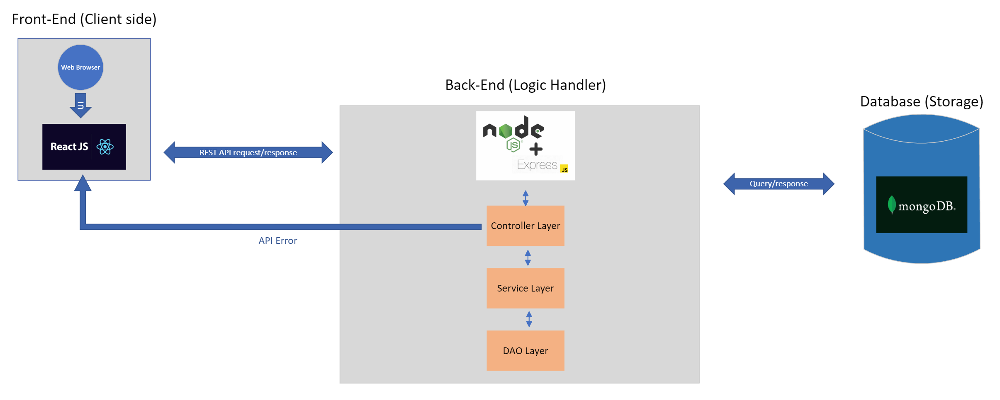

# Developer Notes

---

## Architecture 



## Tools and Technologies 

#### General

- **JavaScript**
- **Axios** - handling HTTP requests
- **Docker** - deployment
- **GitHub Actions** - CI/CD pipeline implementation
- **Prettier** - code formatter to force a consistent style

#### Front End

- **React** - library for implementing a user interface
- **Vite** - build tool 
- **ToastUI** - javascript calendar API 
- **NextUI** - react ui library for buttons, navbar, etc. 
- **HTML** and **CSS**

#### Back End

- **Node.js** - javascript runtime environment 
- **Express.js** - API framework
- **MongoDB** - data storage
- **mongoose** - library to easily connect mongoDB to Node.js

#### Testing

- **Jest** - for unit and integration tests
- **Artillery** - load testing
- **CodeQL** - security analysis


## Project Organization 

```
.
├── back_end
│   ├── controllers
│   ├── models
│   ├── routes
│   └── test
├── docs
│   ├── presentations
│   ├── sprint-1
│   ├── sprint-2
│   ├── sprint-3
│   └── sprint-4
└── front_end
    ├── public
    └── src
```

## Branching Strategy 

Our main branch has protections, so all changes must go through a pull request and be approved by at least one other team member before merging to main. 

In general, we will create a branch directly from the github issue it is addressing. This means that a branch should only change one aspect of the codebase. The following format of naming a branch is as follows: `[issue number]-[issue type]-[issue name]`.

## Coding Standards 

We will follow the basic JS and HTML/CSS coding conventions. 

**Resources**
- [JavaScript (w3schools)](https://www.w3schools.com/js/js_conventions.asp)
- [JavaScript (mozilla)](https://developer.mozilla.org/en-US/docs/MDN/Writing_guidelines/Writing_style_guide/Code_style_guide/JavaScript)
- [HTML (w3schools)](https://www.w3schools.com/html/html5_syntax.asp)
- [HTML (freecodecamp)](https://www.freecodecamp.org/news/html-best-practices/)

#### Naming Conventions 

- Use `camelCase` for variables and functions. 
- All names start with a letter.
- Use descriptive names for variables and functions.

#### Styling  

- Put spaces around operators (`= + - * /`), and after commas.
  ```
  let x = y + z; 
  const myArray = ["item1", "item2", "item3"]
  ```
- Use 2 spaces for indentation of code blocks. 
- Always end simple statements with a semicolon. 
- Line length should always be less than 80 characters. 

#### General 

- Always declare local variables (use `var`, `let`, or `const`).
- Put all declarations at the top of each script or function. 
- Initialize variables.
- Add comments when necessary, but code should be easy to understand. 
