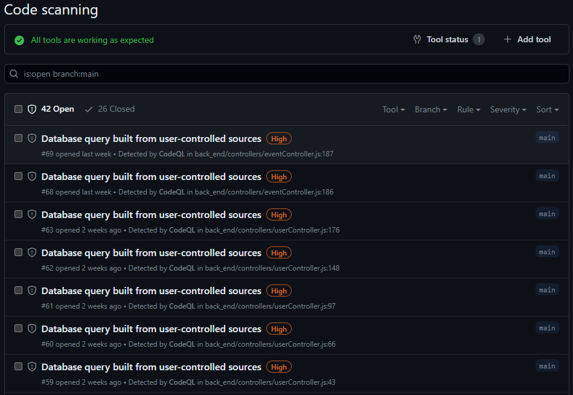

# FamilyHub Release Summary

## Team members 

| Member             | GitHub ID          | Email                   | Role | 
|--------------------|--------------------|-------------------------|---|
| Freyja Kristjanson | @FreyjaKristjanson | kristjaf@myumanitoba.ca |Backend Developer, DB Manager|
| Jasmine Tabuzo     | @jasmine-tabuzo    | tabuzoj@myumanitoba.ca  |Full-stack developer|
| Juan Armijos       | @armijosj          | armijosj@myumanitoba.ca |Configuration Manager, Installation Team|
| Tanisha Turner     | @TTanisha          | turnert1@myumanitoba.ca |Frontend Developer|


## Project summary

### Elevator Pitch 

*FamilyHub* is the ultimate solution for families seeking to strengthen their connections and build stronger bonds. It is a web-based application that offers a private shared calendar to help families stay on top of important events with their loved ones. With its user-friendly interface and innovative features, *FamilyHub* aims to reduce friction and conflict within a family by improving communication and organization. Providing a platform for families to stay connected, share memories, plan events, and build stronger bonds, *FamilyHub* is the perfect tool to bring families closer together. Sign up for *FamilyHub* today and experience the positive impact it will have on your family's life!

> Because Family is Complicated Enough. 

### Differences

There are not many differences between our proposal and the final version. The main differences are due to a lack of specificity in our proposal. 

For our `Shared Calendar` core feature, we only specified that a user would be able to view the calendar in a monthly or daily view, but they are also able to use a weekly view as well. Similarly, we did not originally specify that only the user that created the event is able to edit or delete it, but that is the case in the final version. 

We used all of the technologies we outlined in our proposal, but those were more a starting point. On the front-end we used `vite` as a build tool, and two frameworks (`ToastUI` and `NextUI`) alongside our original plan of `ReactJS`. On the back-end we used `Node.js` and `Express.js`, but we also used `mongoose` to aid in the connection to `mongoDB`. We also used `axios` for handling http requests, `Docker` for deployment, and `GitHub Actions` for implementing the CI/CD pipeline. 


## GitHub repository Link

https://github.com/TTanisha/FamilyHub

## DockerHub repository link 

1. **DockerHub link:** [Docker - FamilyHub](https://hub.docker.com/repository/docker/armijosj/familyhub/general)

2. **Instructions:**

    In a terminal run the following commands:
    ```
    docker pull armijosj/familyhub:server
    docker run -p 8080:8080 armijosj/familyhub:server
    ```

    In a different terminal:
    ```
    docker pull armijosj/familyhub:client
    docker run -p 5173:5173 armijosj/familyhub:client
    ```

    You can now access FamilyHub at ```http://localhost:5173/```

    *NOTE:* Run server before running client. 


## User Stories for each sprint

### Sprint 1

- Sprint 1 was used for planning.

### Sprint 2 

- US [#1](https://github.com/TTanisha/FamilyHub/issues/1): View Shared Calendar [Status: Done]

- US [#51](https://github.com/TTanisha/FamilyHub/issues/51): Create an Account [Status: Done]

- US [#53](https://github.com/TTanisha/FamilyHub/issues/53): Sign Into Account [Status: Done]

- US [#2](https://github.com/TTanisha/FamilyHub/issues/2): Individual Profile [Status: Pushed]

- US [#20](https://github.com/TTanisha/FamilyHub/issues/20): Delete Individual Profile [Status: Pushed]

- US [#52](https://github.com/TTanisha/FamilyHub/issues/52): Delete an Account [Status: Pushed]

- US [#54](https://github.com/TTanisha/FamilyHub/issues/54): Sign Out of Account [Status: Pushed]

- US [#55](https://github.com/TTanisha/FamilyHub/issues/55): Add Personal Information [Status: Pushed]

- US [#56](https://github.com/TTanisha/FamilyHub/issues/56): Edit Personal Information [Status: Pushed]

- US [#63](https://github.com/TTanisha/FamilyHub/issues/63): Edit Personal Information [Status: Pushed]


### Sprint 3 

- US [#2](https://github.com/TTanisha/FamilyHub/issues/2): Individual Profile [Status: Done]

- US [#3](https://github.com/TTanisha/FamilyHub/issues/3): Add Events [Status: Done]

- US [#4](https://github.com/TTanisha/FamilyHub/issues/4): Remove Events [Status: Done]

- US [#5](https://github.com/TTanisha/FamilyHub/issues/5): Edit Events [Status: Done]

- US [#20](https://github.com/TTanisha/FamilyHub/issues/20): Delete Individual Profile [Status: Done]

- US [#21](https://github.com/TTanisha/FamilyHub/issues/21):Invite Family Members to group [Status: Done]

- US [#22](https://github.com/TTanisha/FamilyHub/issues/22):Create Family Group [Status: Done]

- US [#23](https://github.com/TTanisha/FamilyHub/issues/23):Leave Family Group [Status: Done]

- US [#52](https://github.com/TTanisha/FamilyHub/issues/52): Delete an Account [Status: Done]

- US [#54](https://github.com/TTanisha/FamilyHub/issues/54): Sign Out of Account [Status: Done]

- US [#55](https://github.com/TTanisha/FamilyHub/issues/55): Add Personal Information [Status: Done]

- US [#56](https://github.com/TTanisha/FamilyHub/issues/56): Edit Personal Information [Status: Done]

- US [#63](https://github.com/TTanisha/FamilyHub/issues/63): Edit Personal Information [Status: Done]

### Sprint 4 

- All User stories were completed in Sprint 3.

### Release

- All User stories were completed in Sprint 3.

## User manual

### 1. Family Member Profiles

#### 1.1 Create an account

1. While not logged in, go to the home page
2. Select `Create an Account` 
3. Fill in the required fields (first name, last name, email address, password, and birthday)
    - email should be of the format "email@domain" (ex. jane.doe@example.com) 
    - password should be more than 6 characters 
4. Select `Create Account`
5. (Optional) Fill in additional profile details 
6. Select `Complete My Profile`

#### 1.2 Update your account

1. While logged in, select the profile icon in the top-right 
2. Select `My Profile` 
3. Select `Edit`
4. Edit the fields you want to update
5. Select `Update`

#### 1.3 Delete your account 

1. While logged in, select the profile icon in the top-right 
2. Select `My Profile`
3. Select `Delete Account`
4. Select `Yes, delete my account`

#### 1.4 View a family member's profile 

1. Select `Family Groups` in the navigation bar
2. Select the name of the family group the member is a part of 
3. Select their name in the dropdown list 

### 2. Family Groups

#### 2.1 Create a family group

1. Select `Family Groups` in the navigation bar
2. Select `Create Family Group`
3. Enter a family group name 
4. Select `Submit` 

#### 2.2 View a family group

1. Select `Family Groups` in the navigation bar
2. Select the name of the family group you would like to view
    - A list of all the family members in this group should be displayed in the dropdown list

#### 2.3 Add a member to a family group

1. Select `Family Groups` in the navigation bar
2. Select the name of the family group you would like to add a member to
3. Select `Add Member` 
4. Enter the email address associated with the family member's FamilyHub account
5. Select `Submit`

#### 2.4 Leave a family group

1. Select `Family Groups` in the navigation bar
2. Select the name of the family group you would like to leave
3. Select `Leave Group` 
4. Select `Leave this group`

### 3. Shared Calendar

#### 3.1 Navigate the calendar

#### 3.1.1 Change month/day/week

There are two options for navigating the calendar:
1. Use the prev arrow, next arrow, and today buttons at the top of the calendar
2. Select a date using the date selector on the left 

#### 3.1.2 Monthly/Weekly/Daily View

1. Select the dropdown under "Select View:"
2. Select the desired view (Monthly/Weekly/Daily) 

#### 3.2 Create an event 

1. Go to the Calendar page 
2. Select `Create Event`
3. Enter an event title 
4. Enter a start date/time and an end date/time
    - Note: Start date/time must be before end date/time
5. (Optional) If the event is an all day event, select the `All day` checkbox 
6. (Optional) If this is a recurring event, select the `Recurring` checkbox    
    - 6.1. Select the recurrence type (Daily/Weekly/Monthly/Yearly)
    - 6.2. Enter the number of times you want this event to occur
        - Ex. An event on Apr. 1, 2023 with recurrence set to `Monthly 2` will occur on Apr 1, 2023 and May. 1, 2023. 
7. (Optional) Enter a description
8. (Optional) Enter a location 
9. Select `Submit` 

NOTE: Once created, an event cannot be switched from a recurring to a non-recurring event and vice versa. 

#### 3.3 View an event

1. Go to the Calendar page 
2. Locate the event you would like to edit on the calendar
3. Select the event
    - This should open up the event details modal

#### 3.4 Edit a non-recurring event

NOTE: A non-recurring event cannot be turned into a recurring event. Please create a new event if you would like a recurring one. 

NOTE: Only the event creator can edit the event.

1. Go to the Calendar page 
2. Locate the event you would like to edit on the calendar
3. Select the event
4. Select `Edit` 
5. Edit the event details that you want to update
6. Select `Save`

#### 3.5 Edit a recurring event

NOTE: An recurring event cannot be turned into a non-recurring event. Please delete the recurring series if you would like a non-recurring one instead.

NOTE: Only the event creator can edit the event.

#### 3.5.1 Edit an _entire_ recurring series 

NOTE: Updating a series will overwrite ALL existing events in the series, including past and future events. Please make sure the start and end date/time is set to the start and end date/tme of the first occurrence in the series. 

1. Go to the Calendar page 
2. Locate the **first** occurrence of the recurring event series you would like to edit on the calendar
    - This is to ensure the updated recurrence will start on the correct date.
3. Select the event
4. Select `Edit this series` 
5. Edit the event details that you want to update
6. Select `Save series`

#### 3.5.2 Edit a _single_ event in a recurring series: 

1. Go to the Calendar page 
2. Locate the event you would like to edit on the calendar
3. Select the event
4. Select `Edit this event` 
5. Edit the event details that you want to update
6. Select `Save event`

#### 3.6 Delete an event

NOTE: Only the event creator can delete the event.

1. Go to the Calendar page 
2. Locate the event you would like to delete on the calendar
3. Select the event
4. Select `Delete` 
5. If this event was part of a recurrence,
    - If you would like to delete the entire recurring series, select `Delete the entire series`
    - If you would like to delete the single event in the recurring series, select `Delete this event` 

## Overall Architecture and Design

Project Organization: 
```
.
├── back_end
│   ├── controllers
│   ├── models
│   ├── routes
│   └── test
├── docs
├── front_end
│   ├── public
│   └── src
└── project_release
```

- [Architecture Diagram](https://github.com/TTanisha/FamilyHub/blob/main/docs/sprint-1/architecture-diagram.png)
- [Sequence Diagrams](https://github.com/TTanisha/FamilyHub/tree/main/docs/sprint-2/Sequence%20Diagrams)
  - [User Profile](https://github.com/TTanisha/FamilyHub/blob/main/docs/sprint-2/Sequence%20Diagrams/profile-page-sequence-diagram.png)
  - [Family Group](https://github.com/TTanisha/FamilyHub/blob/main/docs/sprint-2/Sequence%20Diagrams/family-group-sequence-diagram.png)
  - [Shared Calendar](https://github.com/TTanisha/FamilyHub/blob/main/docs/sprint-3/sequence-diagram-shared-calendar-v2.png)  

## Infrastructure

- **JavaScript** [link]( https://developer.mozilla.org/en-US/docs/Web/JavaScript)

    We chose it because it is the most popular scripting language and is widely supported by web browsers, making it an excellent choice for client-side web development.

- **Axios** [link](https://axios-http.com/docs/intro)

    It's a lightweight and easy-to-use library for making HTTP requests in JavaScript applications. It has better error handling and supports automatic serialization of request and response data.

- **Docker** [link](https://docs.docker.com/)

    It provides a consistent and reproducible environment for developing and deploying applications, making it easier to manage dependencies and ensure consistency across different environments.

- **GitHub Actions** [link](https://docs.github.com/en/actions)

    It provides an easy-to-use and powerful platform for automating the software development process, just like Jenkins. The difference is that it is integrated with Github repos; therefore, it will be easier for us to create, manage and run workflows for building, testing and deploying software. Having things in one place will allow us to be more efficient.

- **Prettier** [link](https://reactjs.org/docs/getting-started.html)

    It's a code formatter that helps maintain consistent code style across the entire codebase, making it easier to read and understand code. It is a simple VS Code plug-in.

#### **Front End**

- **React** [link](https://reactjs.org/docs/getting-started.html)

    It's a popular JavaScript library for building user interfaces that allows for easy component-based development, efficient rendering, and easy integration with other libraries and frameworks. We choose it over Angular or Vue because of it relatively low learning curve.

- **Vite** [link](https://vitejs.dev/guide/)

    It's a fast build tool that helps reduce development time by improving the build and reload speed of modern web applications.

- **ToastUI** [link](https://ui.toast.com/)

    It's a collection of customizable UI components for building modern web applications with ease and provides a rich set of features and flexibility. We choose it because it has calendar component. Additionally, it was a TA recommendation.

- **NextUI**  [link](https://nextjs.org/docs/getting-started)

    It's a React-based UI framework that provides pre-built UI components and an easy-to-use API to help build modern web applications. We choose it because it has straight forward documentation.

#### **Back End**

- **Node.js** [link](https://nodejs.org/en/docs/)

    It's a JavaScript runtime that allows developers to build fast and scalable applications on the server-side using JavaScript. We use it because is the most common among web applications.


- **Express.js** [link](https://expressjs.com/)

    It's a fast and minimal web framework for Node.js that makes it easy to build web applications and APIs. It made the routing fast and easy.


- **MongoDB** [link](https://docs.mongodb.com/)

    It's a popular NoSQL database that provides high scalability, flexibility, and document-based data storage for modern web applications. It is also a popular choice for modern web applications because it allows for storing semi-structured data, making it a good fit for applications with dynamic data models.

- **Mongoose** [link](https://mongoosejs.com/docs/)

    It's a MongoDB object modeling tool that provides a schema-based solution to model and interact with MongoDB data. This library made our database connection really simple.

#### **Testing**

- **Jest** [link](https://jestjs.io/docs/getting-started)

    It's preferred over other JavaScript testing frameworks because it has an easy-to-use API, a rich set of features, and good integration with other tools and frameworks. Plus we liked the code coverage feature.


- **Artillery** [link](https://artillery.io/docs/)

    It's a load testing tool that helps developers simulate and measure the performance of their applications under load and provides an easy-to-use API for creating complex test scenarios. We liked it because of the HTML generated report after the test.


- **CodeQL** [link](https://codeql.github.com/docs/)

    It's a static analysis tool that helps developers identify security vulnerabilities and other bugs in their codebase, with easy to set up instructions and lots of community support.

### Name Conventions

[This](https://github.com/TTanisha/FamilyHub/blob/main/docs/sprint-4/developer_notes.md#coding-standards) section of our developer notes document discusses our coding standards and naming conventions. In general, we followed the basic JavaScript conventions, using `camelCase` for variables and functions, `UPPERCASE` for global constants, all names start with a letter, and names are descriptive and useful. 

### Code

| File Path | Purpose | 
| --------- | ------- |
| [back_end/controllers/eventController.js](https://github.com/TTanisha/FamilyHub/blob/main/back_end/controllers/eventController.js) | The back-end controller methods for events |
| [back_end/models/eventModel.js](https://github.com/TTanisha/FamilyHub/blob/main/back_end/models/eventModel.js) | The back-end event model |
| [front_end/src/App.jsx](https://github.com/TTanisha/FamilyHub/blob/main/front_end/src/App.jsx) | The front-end file used for our navigation and router |
| [front_end/src/components/calendar/viewEvent.jsx](https://github.com/TTanisha/FamilyHub/blob/main/front_end/src/components/calendar/viewEvent.jsx) | The front-end view/edit event modal in the calendar |
| [front_end/srs/pages/signPages/signUp.jsx](https://github.com/TTanisha/FamilyHub/blob/main/front_end/src/pages/signPages/signUp.jsx) | The front-end sign up page |

## Continuous Integration and deployment (CI/CD)

We are using Github Actions for our CI/CD pipeline. We separated the pipeline into three different workflows that run when there is an update to the main branch.

- Regression Testing [Link to workflow](https://github.com/TTanisha/FamilyHub/blob/main/.github/workflows/regression-testing.yml)

    Regression testing is the first workflow that runs in our pipeline. If it fails then the image does not get pushed to DockerHub. Here is an [instance](https://github.com/TTanisha/FamilyHub/actions/runs/4683106504) of the job.

    

- Push Image [Link to workflow](https://github.com/TTanisha/FamilyHub/blob/main/.github/workflows/push-image.yml)

    This is our second step in our pipeline. It pushes the image to DockerHub with the updated version of the main branch. Here is an [instance](https://github.com/TTanisha/FamilyHub/actions/runs/4683106498) of the job.

    

- CodeQL Scan [Link to workflow](https://github.com/TTanisha/FamilyHub/blob/main/.github/workflows/codeql-scan.yml)

    This workflow performs a static analysis using CodeQL and notifies if there are any potential security breaches. Here is an [instance](https://github.com/TTanisha/FamilyHub/actions/runs/4681285508) of the job.

    


## Testing

[Link to Testing Plan](https://github.com/TTanisha/FamilyHub/blob/main/docs/sprint-3/Testing_Plan.md)


### Unit / Integration / Acceptance Tests

Each user story was tested and marked as complete. The code coverage for this project is 100%. All tests are separated first by the type of test, then by the main feature they belong to: Event, User, and Family Group.

The tests include
- 45 User tests
  - 19 unit tests
  - 26 integration tests
- 52 Event tests
  - 20 unit tests
  - 32 integration tests
- 31 Family Group tests
  - 14 unit tests
  - 17 integration tests

For a total of 128 tests, 53 unit tests and 75 integration tests.

#### 10 Most Important Unit Tests 

The unit test files contain all unit tests, named by the main feature the user stories were a part of. The exact line for the most important unit test is linked below.

| Test File Path | What it is Testing | 
| -------------- | ------------------ |
|[back_end/test/unit/models/event.test.js#L154](https://github.com/TTanisha/FamilyHub/blob/main/back_end/test/unit/models/event.test.js#L154) | Invalid event end date given                    |
|[back_end/test/unit/models/event.test.js#L189](https://github.com/TTanisha/FamilyHub/blob/main/back_end/test/unit/models/event.test.js#L189) | No event date given                             |
|[back_end/test/unit/models/event.test.js#L269](https://github.com/TTanisha/FamilyHub/blob/main/back_end/test/unit/models/event.test.js#L269) | Successful event update                         |
|[back_end/test/unit/models/event.test.js#L189](https://github.com/TTanisha/FamilyHub/blob/main/back_end/test/unit/models/event.test.js#L189) | Event deletion                                  |
|[back_end/test/unit/models/familyGroup.test.js#L99](https://github.com/TTanisha/FamilyHub/blob/main/back_end/test/unit/models/familyGroup.test.js#L99) | Family Group creation with duplicated name |
|[back_end/test/unit/models/familyGroup.test.js#L167](https://github.com/TTanisha/FamilyHub/blob/main/back_end/test/unit/models/familyGroup.test.js#L167) | Adding a user already in the Famlily Group|
|[back_end/test/unit/models/familyGroup.test.js#L278](https://github.com/TTanisha/FamilyHub/blob/main/back_end/test/unit/models/familyGroup.test.js#L278) | Delete existing Family Group              |
|[back_end/test/unit/models/user.test.js#L108](https://github.com/TTanisha/FamilyHub/blob/main/back_end/test/unit/models/user.test.js#L108) | Create user with duplicate email                 |
|[back_end/test/unit/models/user.test.js#L191](https://github.com/TTanisha/FamilyHub/blob/main/back_end/test/unit/models/user.test.js#L191) | Get user with valid email, invalid password      |
|[back_end/test/unit/models/user.test.js#L1324](https://github.com/TTanisha/FamilyHub/blob/main/back_end/test/unit/models/user.test.js#L1324) | Delete User                                     |

#### 5 Most Important Integration Tests  

| Test File Path | What it is Testing | 
| -------------- | ------------------ |
|[back_end/test/integration/event.test.js#L401](https://github.com/TTanisha/FamilyHub/blob/main/back_end/test/integration/event.test.js#L401) | Return events from Family Group           |
|[back_end/test/integration/event.test.js#L607](https://github.com/TTanisha/FamilyHub/blob/main/back_end/test/integration/event.test.js#L607) | Delete existing event                     |
|[back_end/test/integration/familyGroup.test.js#L103](https://github.com/TTanisha/FamilyHub/blob/main/back_end/test/integration/familyGroup.test.js#L103) | Create Family Group with duplicate group name    |
|[back_end/test/integration/familyGroup.test.js#L211](https://github.com/TTanisha/FamilyHub/blob/main/back_end/test/integration/familyGroup.test.js#L211) | Family Group with valid group and duplicate user |
|[back_end/test/integration/user.test.js#L117](https://github.com/TTanisha/FamilyHub/blob/main/back_end/test/integration/user.test.js#L117) | Create User with existing email                 |


#### 5 Most Important Acceptance Tests 

NOTE: Our acceptance tests are all manual. Links will be provided to the manual acceptance test steps in our Testing Plan. 

| Test File Path | What it is Testing | 
| -------------- | ------------------ |
| [Create Account](https://github.com/TTanisha/FamilyHub/blob/main/project_release/acceptance_tests.md#given-a-user-is-on-the--sign-up-page) | Creating an account with valid input data (US [#51](https://github.com/TTanisha/FamilyHub/issues/51): Create an Account) |
| [Create Event](https://github.com/TTanisha/FamilyHub/blob/main/project_release/acceptance_tests.md#given-when-a-user-is-on-the-create-event-form) | Creating an event with valid input data (US [#3](https://github.com/TTanisha/FamilyHub/issues/3): Add Events) |
| [Leave Family Group](https://github.com/TTanisha/FamilyHub/blob/main/project_release/acceptance_tests.md#given-a-user-is-on-the-leave-group-confirmation-modal-2) | Leaving a family group as the last member of the family (US [#23](https://github.com/TTanisha/FamilyHub/issues/23):Leave Family Group) |
| [Edit Event](https://github.com/TTanisha/FamilyHub/blob/main/project_release/acceptance_tests.md#given-a-user-is-on-an-events-details-page-1) | Editing an event that was not created by the logged-in user (US [#5](https://github.com/TTanisha/FamilyHub/issues/5): Edit Events) |
|  [View Member Profiles](https://github.com/TTanisha/FamilyHub/blob/main/project_release/acceptance_tests.md#given-a-user-is-logged-in) | Viewing a family member's profile (US [#2](https://github.com/TTanisha/FamilyHub/issues/2): Individual Profile) |

### Regression testing

We used Jest for our regression testing. The workflow runs all tests from our test folders whenever changes are pushed to our main branch, in a random order. The tests are seperated by the type of test, then by the main feature they belong to. The tests contain all 53 unit tests and 75 integration tests for a total of 128 tests total.

Below is an image of the latest run of the integration tests.


Click [here](https://github.com/TTanisha/FamilyHub/blob/main/.github/workflows/regression-testing.yml) to see the regression testing workflow script.

### Load testing

We used Artillery to simulate multiple virtual users making API requests to a target our server. Our load test was designed to simulate the behavior of 200 users making a total of 1000 requests in 1 minute, with each user making 5 requests.

Here are our [test scenarios](https://github.com/TTanisha/FamilyHub/blob/main/back_end/test/load_test/load_test.yml). The test scenarios were divided into three types: Log in, Populate Calendar, and Get and Edit an Event. The scenarios were executed in parallel, and the load test ran for a total of 60 seconds.

We have a report in [raw](https://github.com/TTanisha/FamilyHub/blob/main/back_end/test/load_test/load_test.json) and in [HTML](https://github.com/TTanisha/FamilyHub/blob/main/back_end/test/load_test/load_test.json.html).

Below is a snapshot of the HTML report, which indicates that the load test was successful. The test generated zero errors and maintained a stable connection for all users, suggesting that no bottlenecks were present. Based on this, we can conclude that the system can handle the current load without performance issues.


### Security Analysis

We used CodeQL as our security analysis tool for this project. CodeQL is a static analysis tool that helps developers identify security vulnerabilities and other bugs in their codebase, with easy to set up instructions and lots of community support.

The tool is run using a GitHub Actions workflow which can be seen [here](https://github.com/TTanisha/FamilyHub/blob/main/.github/workflows/codeql-scan.yml).

It is currently set up to analyse JavaScript, as this is the main language used for our application.

[Here](https://medium.com/mycostech/lets-analyze-your-code-repository-in-github-via-codeql-engine-dd196354f77e) is a tutorial for setting up and using CodeQL with GitHub Actions.

Below is a sample of a report generated for our project by CodeQL.


#### Problem Discussion
1. **Database Query Built from User-Controlled Sources**

    _back_end/controllers/eventController.js:187_

    The queries made to our database by our event controller depend on user input values. There is not currently sufficient sanitization of the user data to prevent malicious database queries from being run.
    
    Click [here](https://github.com/TTanisha/FamilyHub/security/code-scanning/69) to see the security alert.
    
2. **Database Query Built from User-Controlled Sources**

    _back_end/controllers/familyGroupController.js:28_
    
    Like in the above issue, the queries made to our database by our family group controller depend on user input values. The user data is not safely embedded into the query which leaves it vulnerable to malicious queries.
    
    Click [here](https://github.com/TTanisha/FamilyHub/security/code-scanning/51) to see the security alert.
    
3. **Missing Rate Limiting**

    _back_end/routes/userRoutes.js:14_
    
    The route handlers used in our application do not currently implement any rate-limiting middleware. Due to this our code could be vulnerable to attacks or crashes caused by having many calls made in a short period of time.

    Click [here](https://github.com/TTanisha/FamilyHub/security/code-scanning/18) to see the security alert.
    
4. **Inefficient Regular Expression**

    _back_end/controllers/userController.js:6_
    
    In the back end of the project there are a few regular expressions that are not as efficient as they could be. Given the way that it is currently written, it could take a long time to match the input string.

    Click [here](https://github.com/TTanisha/FamilyHub/security/code-scanning/67) to see the security alert.
    
5. **Polynomial Regular Expression used on Uncontrolled Data**

    _back_end/controllers/userController.js:8_
    
    Similarly to the above issue, there are a few parts of our code that uses regular expressions that are not as efficient as they could be. In this situation the regular expression is used on uncontrolled user data which could be time consuming to evaluate.
    
    Click [here](https://github.com/TTanisha/FamilyHub/security/code-scanning/46) to see the security alert.
